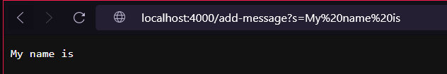
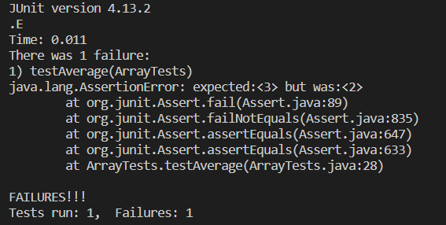

# Lab Report 2
## Part 1
```
import java.io.IOException;
import java.net.URI;

class Handler implements URLHandler {
    String message = "";

    public String handleRequest(URI url) {
        if (url.getPath().equals("/")) {
            return String.format("Try to use a /add-message?s=<string> path ");
        } 
        else {
            if (url.getPath().contains("/add-message")) {
                String[] parameters = url.getQuery().split("=");
                if (parameters[0].equals("s")) {
                    message += parameters[1] + "\n";
                    return String.format(message);
                }
            }
            return "404 Not Found!";
        }
    }
}

class StringServer {
    public static void main(String[] args) throws IOException {
        if(args.length == 0){
            System.out.println("Missing port number! Try any number between 1024 to 49151");
            return;
        }

        int port = Integer.parseInt(args[0]);

        Server.start(port, new Handler());
    }
}
```



Above are 2 screenshots and code from the StringServer, The screenshots show how the `/add-message?s=<String>` feature works in the web server. In both cases, they both call on String handleRequest(URI url) method, which takes the url of the website as the argument. In both, the method takes note that the path is `/add-message`, so it checks for the query and splits it into an array named parameter to check seperate the string into elements seperated by the `=`. The array has two elements one before the = and one after. In both screenshots, since the first element is `s` then the second element will be added to the string variable `message` together with `\n` to print a new line. For the first screenshot, message was updated to `"My name is" + "\n"`, then in the second screenshot it was updated to `"My name is" + "\n" + "Wilson Sugiarto" "\n"`. The message variable is updated whenever the website is refreshed so as you can see in the first screenshot it only has `My name is` then the second has `Wilson Sugiarto` in the second line.

## Part 2
```
public class ArrayTests {
  @Test
  public void testAverage() {
    double[] success = {1, 2, 3, 4};
    double[] failure = {2, 2, 4};
    //failure inducing input
    assertEquals(3, (int)ArrayExamples.averageWithoutLowest(failure));
    //non failure inducing input
    assertEquals(3, (int)ArrayExamples.averageWithoutLowest(success));

  }
}
```


**BEFORE FIX**
```
static double averageWithoutLowest(double[] arr) {
    if(arr.length < 2) { return 0.0; }
    double lowest = arr[0];
    for(double num: arr) {
      if(num < lowest) { lowest = num; }
    }
    double sum = 0;
    for(double num: arr) {
      if(num != lowest) { sum += num; }
    }
    return sum / (arr.length - 1);
  }
  ```
**AFTER FIX**
```
static double averageWithoutLowest(double[] arr) {
    if(arr.length < 2) { return 0.0; }
    double lowest = arr[0];
    for(double num: arr) {
      if(num < lowest) { lowest = num; }
    }
    double sum = 0;
    for(double num: arr) {
      sum += num; 
    }
    return (sum - lowest) / (arr.length - 1);
  }
  ```
Changing the last for loop to not have the if statement works because that was where the bug was. Before fixing it, the for loop would remove all the numbers that had the same value as `lowest` instead of just a single one, hence by removing the if statement and simply subtracting `lowest` from `sum` in the return statement, the bug was fixed and the tests worked properly. 

## Part 3
Last week(week 2) while we did learn of using the and implementing URLHandler in class, I found it quite useful that we got to use it practically in the week 2 lab. I learned about how the interface allowed us to implement the method `public String handleRequest(URI url)` which is what allows us to manipulate what we see in the web server using the URL as the argument for changes to the web server. I also learned to be able to use the `getPath()` and `getQuery()` better during week 2's lab. 
